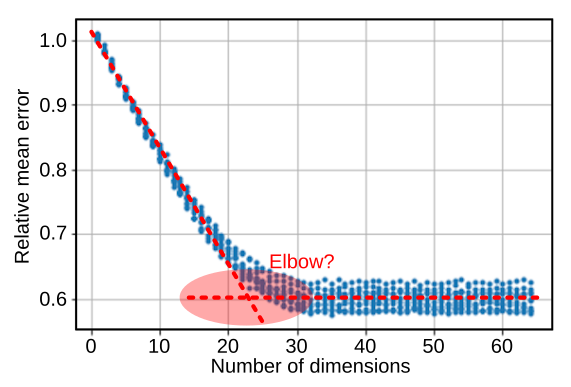
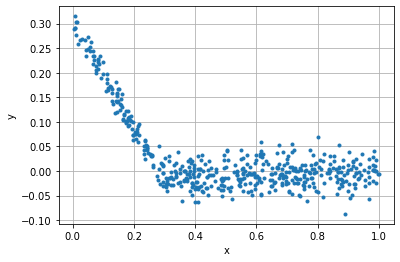
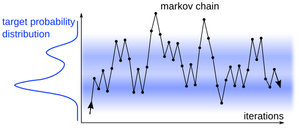
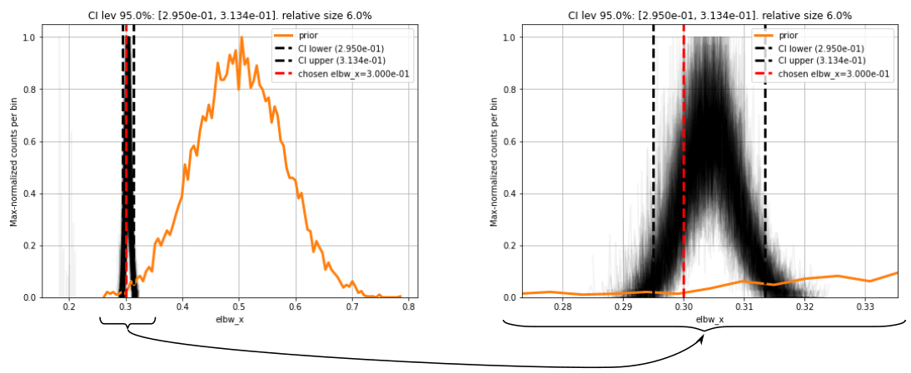
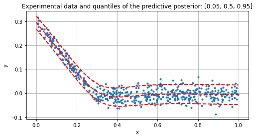

# Bayesian Elbow Detection with tensorflow_probability

#### Detecting switch-point in the gradient of a line using probabilistic approach


*What are the positions of bends? [Image by author]*


## Introduction

Elbow method is a well-known approach to selecting hyper-parameters in simple optimization tasks. For example, in [k-means clustering](https://medium.com/mlearning-ai/k-means-clustering-using-elbow-method-208b23c78150), the elbow method can be used to choose an appropriate number of clusters; in [dimensionality reduction](https://towardsdatascience.com/dimensionality-reduction-forensics-50014430767f), the elbow method can be used to select an appropriate number of dimensions. Whilst conceptually simple, robust implementation of the elbow method may be challenging. Here I will show how `tensorflow_probability` can be leveraged to tackle this problem with a [Bayesian approach](https://en.wikipedia.org/wiki/Bayesian_statistics).

As an example, I have generated N=70 observations of m=32 independent random variables (normally distributed), then embedded them into n=64 dimensional space (with random orientation). This creates 64 random variables with strong correlations. Now imagine such data set (70 x 64 matrix of real numbers) is presented for analysis. One may want to remove correlations is using [Principal Component Analysis](https://en.wikipedia.org/wiki/Principal_component_analysis) (PCA), for example. PCA can be used to reduce the number of dimensions to, for example, 32. To understand whether 32, or any other number of dimensions, is a good fit for the data, one can invert PCA and check whether it leads to accurate reproduction of source data. If the number of dimensions, into which PCA projects the data, is too low, accurate reproduction will be improbable and one will get a large reproduction error. Figure below shows the plot in reproduction error as a function of number of dimensions. Key points to note is that the reproduction error is decreasing as the number of dimensions grows. This carries on until about 30 and then there is leveling off. The point of leveling off, the elbow, should indicate an appropriate number of dimensions, but clearly such choice can be hard to make. Indeed, a naive implementation in which one draws two straight lines and selects the point of intersection, as shown below, would suggest that appropriate number of dimensions to model the data was closer to 20 even though the original data was explicitly 32-dimensional.



*Error in reproducing data following the PCA step as a function of fit dimensions. Original data (for each run) is 32 dimensional, embedded into 64 dimensional space, with 70 observations in each run. Results from 10 runs are shown.*

The problem with trying to estimate the position of the elbow graphically, as outlined in the image above, is not that it gives the ‘wrong’ answer. Far from it, based on data alone (without knowing that initial dataset was 32-dimensional) one could argue that this is the the most optimal choice. Instead, the problem is that the graphical approach, offers no indication of the fact that the data does not constrain the elbow too much. Indeed, any choice of elbow position in the range 22…30 could be argued to be reasonable, based on data. 

The aim of this post is to demonstrate how Bayesian modelling can be used to detect not only the elbow, but also the uncertainty in the position of the elbow. Given such functionality, one could imagine a pipeline that contains an automatic dimensionality reduction step, and which would fire an alert if dimensionality reduction would be too uncertain. Below, I will describe to how to get to uncertainty.

### Probabilistic model for the elbow

To detect the elbow, we first need a model for the data. Here I will assume that data follows a linear trend with normally-distributed errors, but at point (x\*, y\*) all three key parameters (gradient, intercept and variance of the noise) change in a continuous fashion:
$$
\begin{align}
y&=m\cdot x + c + \sigma\cdot n \\
n &\sim N\left(0,\,1\right) \\
m &= m_l + S\left(\frac{x-x*}{\alpha}\right)\cdot\left(m_r - m_l\right) \\
\sigma^2 &= \sigma^2_l + S\left(\frac{x-x*}{\alpha}\right)\cdot\left(\sigma_r^2-\sigma_l^2\right) \\
c_{l,r} &=y* - m_{l,r}\cdot x*\\
S\left(z\right)&=\frac{\exp\left(z\right)}{1+\exp\left(z\right)}
\end{align}
$$
*Probabilistic model for the elbow. Data is assumed to follow a linear trend, but the key parameters are assumed to change at point (x*, y*) — the elbow*

Above S(z) is simply a sigmoid function that changes from 0 to 1, used to have gradient (*m*) and variance (sigma^2) to change smoothly from left to right arm of the elbow. There is also a scale-of-change parameter (\alpha) to accomodate sharp or shallow elbows.

The noise model used in this example is normally-distributed noise. It follows therefore that the likelihood (L) and log-likelihood (l) of observing a point (x, y) given the parameters are:
$$
\begin{align}
L\left(\left(x,\,y\right)\,\big|\,x*,\,y*,\,m_l,\,m_r,\,\sigma^2_l,\,\sigma^2_r,\,\alpha\right)&=\frac{1}{\sqrt{2\pi\sigma^2}}\cdot \exp\left(-\frac{\left(y-m\cdot x-c\right)^2}{2\sigma^2}\right) \\
l\left(\left(x,\,y\right)\,\big|\,x*,\,y*,\,m_l,\,m_r,\,\sigma^2_l,\,\sigma^2_r,\,\alpha\right)&=\log L=-\frac{\left(y-m\cdot x-c\right)^2}{2\sigma^2}-\frac{\log\left(2\pi\sigma^2\right)}{2}
\end{align}
$$
*Likelihood and the log-likelihood of the the (x, y) pair given the probabilistic model*

#### Generating test data

The probabilistic model desribed above can be used straight away to generate some test data to support debugging.

Firstly, import necessary libraries

```python
import numpy as np
import numpy.random as npr

import matplotlib as mpl
import matplotlib.pyplot as pp
import matplotlib.cm as cm

import typing as tp

import tensorflow as tf
import tensorflow_probability as tfp

import scipy as sp
import scipy.stats as sp_sts
```

Then define the model, sample data and plot:

```python
chosen_x_min = 0.
chosen_x_max = 1.
#
chosen_m_l = -1.
6
chosen_m_r = -0.01
#
chosen_alpha = 0.05
#
chosen_sig2_l = 0.0003
chosen_sig2_r = 0.0006
#
chosen_elbw_x = 0.3
chosen_elbw_y = 0.0
#
chosen_y_min = chosen_elbw_y + chosen_m_l * (chosen_x_min - chosen_elbw_x)
chosen_y_max = chosen_elbw_y + chosen_m_r * (chosen_x_max - chosen_elbw_x)
#
logit = lambda s: np.log(s/(1-s))
chosen_eta_x = logit( (chosen_elbw_x - chosen_x_min)/(chosen_x_max - chosen_x_min) ) 
chosen_eta_y = logit( (chosen_elbw_y - chosen_y_min)/(chosen_y_max - chosen_y_min) ) 

data_prob_model = tfp.distributions.JointDistributionNamed({
    'x': tfp.distributions.Uniform(chosen_x_min, chosen_x_max),
    's': lambda x: tfp.distributions.Deterministic(
            tf.math.sigmoid((x-chosen_elbw_x)/chosen_alpha)
        ),
    'm': lambda s: tfp.distributions.Deterministic(
            chosen_m_l + s * (chosen_m_r - chosen_m_l)
        ),
    'sig2': lambda s: tfp.distributions.Deterministic(
            chosen_sig2_l + s * (chosen_sig2_r - chosen_sig2_l)
        ),
    'c': lambda m: tfp.distributions.Deterministic(
            chosen_elbw_y - m*chosen_elbw_x
        ),
    'y': lambda x, m, c, sig2: tfp.distributions.Normal(x*m+c, tf.sqrt(sig2)) 
})


################
fitting_sample = data_prob_model.sample(500)

fitting_xy = tf.stack([fitting_sample['x'], fitting_sample['y']], axis=1)
```

The test data looks like:



*Data generated to test the elbow detection code*

## Parametrization and priors

The result of fitting the Bayesian elbow detection model will be the probability distributions for key model parameters:
$$
x^*,\,y^*,\,m_l,\,m_r,\,\sigma^2_l,\,\sigma^2_r,\alpha
$$
I have found that MCMC (Markov Chain Monte Carlo) and in particular HMC (Hamiltonian Monte Carlo) works well if it is trying to fit variables that can take any real value. Whilst this applies for the gradients, it does not apply to the latter three parameters which are strictly postive. It is therefore convenient to define:
$$
\begin{align}
\sigma^2_{l,r}&=\exp\left(\lambda_{l,r}\right) \\
\alpha&=\exp\left(\lambda_a\right)
\end{align}
$$
Also, the location of the elbow is not entirely arbitrary, we expect the elbow to lie in the range of the different x and y values of `fitting_xy`. We can therefore introduce:
$$
\begin{align}
x^*&=x_0 + S\left(\eta_x\right)\cdot\left(x_1-x_0\right) \\
y^*&=y_0 + S\left(\eta_y\right)\cdot\left(y_1-y_0\right) \\
\end{align}
$$
Where S(...) it the sigmoid function defined earlier. The minimum and maximum values for x* are x_0 and x_1, respectively. Same for y*.  With these transformations, we arrive at parameters that all can take any real value whilst remaining reasonable:
$$
\eta_x,\,\eta_y,\,m_l,\,m_r,\,\lambda_l,\,\lambda_r,\,\lambda_a
$$
Next, it is a good idea to define priors for these parameters. The gradients (m_l, m_r) and logit-transformed elbow postion (eta_x and eta_y) can be taken as normally distributed. Priors for log-transformed variance-type quantities (lambda-s) can be assumed to be Exp-inverse-chi2 distributed, i.e. the exponent of these variables will follow the [inverse-chi2](https://en.wikipedia.org/wiki/Inverse-chi-squared_distribution) distribution, which is common for variances. Thus:
$$
\begin{align}
\eta_{x,y} &\sim N\left(\dots\right) \\
m_{l,r} &\sim N\left(\dots\right) \\
\lambda_{l,r,a} & \sim Exp-inv-\chi^2\left(\dots\right)
\end{align}
$$
Note that these are prior distributions, i.e. a reasonable guess of distirbution of these parameters. Final, i.e. posterior distributions can end up quite different. As will become aparant later on, the main two functions of prior distributions here will be to initialize MCMC and to provide soft constraints on the region MCMC should be exploring.

The implementation of priors is as follows:

```python
def estimate_prior_params(
    x_arr: np.ndarray,
    y_arr: np.ndarray,
    bootstrap_count: int=10
)->tp.Dict[str, float]:
    """
    Given a set of x and y points that contain two linear segments and an elbow 
    use simple polynomial fitting to estimate a range of reasonable gradients 
    for the two linear segments, and a range of reasonable positions for the elbow.
    
    Bootstrapping, i.e. sampling with replacement is used to get the estimates
    
    Arguments:
    ----------
        x_arr: array of horizontal positions of the points used to generate 
        	estimates for the priors
        y_arr: vertical positions ...
        bootstrap_count: number of iterations for bootstrapping
        
    Returns:
    --------
        Dictionary (str->float) with m_mean, m_var, the mean and variance 
        for the gradient as well as the mean squared error from the linear fit.
    """
    bstr_m_arr = []
    bstr_c_arr = []
    bstr_ys2_arr = []
    
    for i_run in range(bootstrap_count):
        i_arg_choice = npr.choice(np.arange(len(x_arr)), size=len(x_arr), replace=True)
        cur_x_arr = x_arr[i_arg_choice]
        cur_y_arr = y_arr[i_arg_choice]
        
        cur_m, cur_c = np.polyfit(cur_x_arr, cur_y_arr, deg=1)
        cur_ys2 = np.var(cur_y_arr - (cur_m*cur_x_arr + cur_c))
        
        bstr_m_arr.append(cur_m)
        bstr_c_arr.append(cur_c)
        bstr_ys2_arr.append(cur_ys2)
    
    bstr_param = {
        'm_mean': np.mean(bstr_m_arr),
        'm_var': np.var(bstr_m_arr),
        'ys2_mean': np.mean(bstr_ys2_arr)
    }
    
    return bstr_param

####


def get_prior_distribution(
    m_mean: float=0.0,
    m_var: float=1.0,
    ys2_mean: float=1.0,
    lam_lr_nu: float=5.0,
    alpha_mean: float=1.0,
    lam_a_nu: float=5.0,
    eta_x_mean: float=0.0,
    eta_y_mean: float=0.0,
    eta_x_var: float=1.0,
    eta_y_var: float=1.0
)->tfp.distributions.JointDistributionNamed:
    """
    Get a prior distribution for the key parameters being modelled. eta-s 
    and m-s are simple normal distrobutions. Lambdas are usedto model variances 
    i.e. exp(lambda)=Variance. A good prior distribution for exp(lambda) 
    is therefore scaled inverse chi-squared
    
    Tensorflow only supports Inverse-Gamma, which is equivalent.
    
    so exp(lambda) ~ Inv-Gamma
    so lambda ~ Exp-Inv-Gamma(nu/2, nu * tau^2/2)
    
    Next need the parameters. nu would be the number of degrees of freedom 
    for chi-2. Good idea to keep this low, but exact value is not important. 
    Therefore choosing to keep it at nu=5, which gives a well-defined variance 
    for lambda. Next, from 
    [wiki](https://en.wikipedia.org/wiki/Scaled_inverse_chi-squared_distribution) 
    it follows that
    
    E[exp(lam)] = nu^2 tau / (nu-2)
    Var[exp(lam)] = 2 * E[exp(lam)]/nu-4
    
    Will ignore Var, since nu is fixed already. Will only set 
    tau=(nu-2) * E[exp(lam)]/nu^2
    
    Arguments:
    ----------
        m_mean: mean for gradients (normal distribution)
        m_var: variance for gradients
        ys2_mean: mean residual squared of the linear fit to the data. 
        	This is essentially a rough mean of the 
            variance. Goes into fitting Exp-Inv-Gamma distirbution
        lam_lr_nu: nu for Exp-Inv-Gamma distribution for the left and right 
        	variance prior. Should not need to change this
        alpha_mean: rough estimate of the mean for Exp-Inv-Gamma prior for 
        	alpha - the scale of smooth change at the elbow
        lam_a_nu: nu for the Exp-Inv-Gamma that models alpha=exp(lambda)
        eta_x_mean: mean for the normal distribution of the elbow position
        eta_x_var: ditto variance
        eta_y_mean: ditto y
        eta_y_mean: ditto variance for y
        
    Returns:
    --------
        Joint named probabiity distribution for eta_x, eta_y, m_l, m_r, 
        	lam_l, lam_r, lam_a
    """
    
    lam_lr_tau2 = tf.constant(ys2_mean*(lam_lr_nu-2)/lam_lr_nu, dtype=tf.float32)
    lam_lr_a = tf.constant(lam_lr_nu/2, dtype=tf.float32)
    lam_lr_b = tf.constant(lam_lr_nu * lam_lr_tau2/2, dtype=tf.float32)
    
    lam_a_tau2 = tf.constant(alpha_mean*(lam_a_nu-2)/lam_a_nu, dtype=tf.float32)
    lam_a_a = tf.constant(lam_a_nu/2, dtype=tf.float32)
    lam_a_b = tf.constant(lam_a_nu * lam_a_tau2/2, dtype=tf.float32)
    
    # NB! bear in mind that in TFP normal distribution takes in standard deviation, not variance
    prior_distr = tfp.distributions.JointDistributionNamed({
        'eta_x': tfp.distributions.Normal(tf.constant(eta_x_mean, dtype=tf.float32), tf.sqrt(tf.constant(eta_x_var, dtype=tf.float32))),
        'eta_y': tfp.distributions.Normal(tf.constant(eta_y_mean, dtype=tf.float32), tf.sqrt(tf.constant(eta_y_var, dtype=tf.float32))),
        'm_l': tfp.distributions.Normal(tf.constant(m_mean, dtype=tf.float32), tf.sqrt(tf.constant(m_var, dtype=tf.float32))),
        'm_r': tfp.distributions.Normal(tf.constant(m_mean, dtype=tf.float32), tf.sqrt(tf.constant(m_var, dtype=tf.float32))),
        'lam_l': tfp.distributions.ExpInverseGamma(lam_lr_a, lam_lr_b),
        'lam_r': tfp.distributions.ExpInverseGamma(lam_lr_a, lam_lr_b),
        'lam_a': tfp.distributions.ExpInverseGamma(lam_a_a, lam_a_b)
    })
    
    return prior_distr
    
###

prior_est_dict = estimate_prior_params(fitting_xy[:50,0].numpy(), fitting_xy[:50,1].numpy())
print(prior_est_dict)
print(get_prior_distribution(
    m_mean=prior_est_dict['m_mean'],
    m_var=prior_est_dict['m_var'],
    ys2_mean=prior_est_dict['ys2_mean']
).sample(5))
```

Note the extra function, `estimate_prior_params`, used to extract reasonable defaults for the subsequent use in a prior. Those estimates need not be precise ('reasonable' is enough) - as long as there is enough datapoints prior will have very small effect.


## Likelihood & posterior

Having constructed prior we can now move to likelihood and posterior. Starting with log-likelihood which is obtained by re-arranging for n, the noise term:

$$
n=\frac{y-m\cdot x - c}{\sigma}
$$

By definition n is the normal variable, so the likelihood of m, c, \sigma is:


$$
\begin{align}
L\left((x,\, y)\right)&=\frac{1}{\sqrt{2\pi\sigma^2}}\cdot\exp\left(-\frac{\left(y-m\cdot x -c\right)^2}{2\sigma^2}\right) \\
l\left((x,\, y)\right)&=\log L\left((x,\, y)\right)=-\frac{\left(y-m\cdot x -c\right)^2}{2\sigma^2}-\frac{\log\left(2\pi\cdot\sigma^2\right)}{2}
\end{align}
$$

Implementing this in code:

```python
def log_lkhd(
    eta_x: tf.Tensor,
    eta_y: tf.Tensor,
    m_l: tf.Tensor,
    m_r: tf.Tensor,
    lam_l: tf.Tensor,
    lam_r: tf.Tensor,
    lam_a: tf.Tensor,
    xy_data: tf.Tensor=fitting_xy # shape (N, 2) where N is the number of points
)->tf.Tensor:
    """
    Accept eta_x, eta_y, m_l, m_r, lam_l, lam_r, lam_a and actual data (xy_data) as 
    tensors and return tensor-valued log-likelihood. The data (xy_data) is asssumed
    to be distributed along the zeroth dimension, whilst parameters are distributed
    along higher dimnesions. All parameters (eta_..., m_..., lam_...) should have the
    same shape. The returned log_likelihood will also be of that shape.
    
    The function is built to be differentiable, i.e. all internal math is within tensors
    
    Arguments:
    ----------
        eta_x: param linked to the horizontal position of the elbow
        eta_y: param linked to the vertical position of the elbow
        m_l: gradient to the left
        m_r: gradient to the right
        lam_l: param linked to variance to the left
        lam_r: param linked to variance to the right
        lam_a: param linked to the scale of the sigmoid change
        xy_data: N,2 tensor with (x,y) pairs of the data we are trying to fit
        
    Returns:
    --------
        tensor of log-likelihoods for different sets of parameters. this is the log-likelihood
        of all data-points together. Same shape as eta_x
    """
    
    # begin by reshaping the input parameters so that first dimension is a singleton for the data
    param_count = tf.reshape(eta_x, [-1]).shape[0]
    
    #
    expanded_eta_x = tf.reshape(eta_x, [1, param_count])
    expanded_eta_y = tf.reshape(eta_y, [1, param_count])
    expanded_m_l = tf.reshape(m_l, [1, param_count])
    expanded_m_r = tf.reshape(m_r, [1, param_count])
    expanded_lam_l = tf.reshape(lam_l, [1, param_count])
    expanded_lam_r = tf.reshape(lam_r, [1, param_count])
    expanded_lam_a = tf.reshape(lam_a, [1, param_count])
    
    #
    expanded_x = tf.repeat(tf.reshape(xy_data[:,0], shape=[-1,1]), repeats=param_count, axis=1)
    expanded_y = tf.repeat(tf.reshape(xy_data[:,1], shape=[-1,1]), repeats=param_count, axis=1)
    
    # extract params
    expanded_sig2_l = tf.exp(expanded_lam_l)
    expanded_sig2_r = tf.exp(expanded_lam_r)
    expanded_alpha = tf.exp(expanded_lam_a)
    #
    x_min = tf.reduce_min(xy_data[:,0])
    x_max = tf.reduce_max(xy_data[:,0])
    y_min = tf.reduce_min(xy_data[:,1])
    y_max = tf.reduce_max(xy_data[:,1])
    #
    expanded_elbw_x = x_min + (x_max - x_min) * tf.sigmoid(expanded_eta_x)
    expanded_elbw_y = y_min + (y_max - y_min) * tf.sigmoid(expanded_eta_y)
    
    # compute log-likelihood
    # for each point
    s_arr = tf.sigmoid(
        (
            expanded_x-tf.repeat(expanded_elbw_x, repeats=expanded_x.shape[0], axis=0)
        )/tf.repeat(expanded_alpha, repeats=xy_data.shape[0], axis=0)
    )
    #
    m_arr = tf.repeat(expanded_m_l, repeats=s_arr.shape[0], axis=0) + (s_arr * (
        tf.repeat(expanded_m_r, repeats=s_arr.shape[0], axis=0) - tf.repeat(expanded_m_l, repeats=s_arr.shape[0], axis=0)
    ))
    #
    sig2_arr = tf.repeat(expanded_sig2_l, repeats=s_arr.shape[0], axis=0) + (s_arr * (
        tf.repeat(expanded_sig2_r, repeats=s_arr.shape[0], axis=0) - tf.repeat(expanded_sig2_l, repeats=s_arr.shape[0], axis=0)
    ))
    #
    c_arr = tf.repeat(expanded_elbw_y, repeats=s_arr.shape[0], axis=0) - (m_arr * tf.repeat(expanded_elbw_x, repeats=s_arr.shape[0], axis=0))
    #
    log_lkhd_arr = - (tf.math.log(2*np.pi*sig2_arr)/2.) - tf.pow(expanded_y - ((expanded_x * m_arr) + c_arr), 2)/(2.*sig2_arr) 
    
    # collapse for all points
    log_lkhd = tf.reduce_sum(log_lkhd_arr, axis=0)
    
    return tf.reshape(log_lkhd, shape=eta_x.shape)

#######

def log_posterior(
    eta_x: tf.Tensor,
    eta_y: tf.Tensor,
    m_l: tf.Tensor,
    m_r: tf.Tensor,
    lam_l: tf.Tensor,
    lam_r: tf.Tensor,
    lam_a: tf.Tensor,
    xy_data: tf.Tensor=fitting_xy,
    prior_distribution: tfp.distributions.JointDistributionNamed=None
)->tf.Tensor:
    """
    Accept eta_x, eta_y, m_l, m_r, lam_l, lam_r, lam_a and actual data (xy_data) as 
    tensors, and prior as a distribution. Return tensor-valued log-posterior. 
    See log_lkhd for more details on parameters
    Posterior is the product of likelihood and prior, so log-posterior is the sum
    
    The function is built to be differentiable, i.e. all internal math is within tensors
    
    Arguments:
    ----------
        eta_x: param linked to the horizontal position of the elbow
        eta_y: param linked to the vertical position of the elbow
        m_l: gradient to the left
        m_r: gradient to the right
        lam_l: param linked to variance to the left
        lam_r: param linked to variance to the right
        lam_a: param linked to the scale of the sigmoid change
        xy_data: N,2 tensor with (x,y) pairs of the data we are trying to fit
        prior_distribution: distribution that has `log_prob` method which returns
            prior probability of eta_..., m_..., lam_... params 
        
    Returns:
    --------
        tensor of log-likelihoods for different sets of parameters. this is the log-likelihood
        of all data-points together. Same shape as eta_x
    """
    
    # get probability of params under prior
    log_prior_tens = prior_distribution.log_prob(
        eta_x=eta_x,
        eta_y=eta_y,
        m_l=m_l,
        m_r=m_r,
        lam_l=lam_l,
        lam_r=lam_r,
        lam_a=lam_a
    )
    
    # get likelihood
    log_lkhd_tens = log_lkhd(
        eta_x=eta_x,
        eta_y=eta_y,
        m_l=m_l,
        m_r=m_r,
        lam_l=lam_l,
        lam_r=lam_r,
        lam_a=lam_a,
        xy_data=xy_data
    )
    
    log_post_tens =  log_prior_tens + log_lkhd_tens
    
    return log_post_tens

#####

prior_distr = get_prior_distribution()
N = 10
#log_lkhd(eta_x=tf.constant(chosen_eta_x, dtype=tf.float32), eta_y=tf.constant(chosen_eta_y, dtype=tf.float32))
log_posterior(
    eta_x=tf.constant([chosen_eta_x]*N, dtype=tf.float32),
    eta_y=tf.constant([chosen_eta_y]*N, dtype=tf.float32),
    m_l=tf.constant([chosen_m_l]*N, dtype=tf.float32),
    m_r=tf.constant([chosen_m_r]*N, dtype=tf.float32),
    lam_l=tf.math.log(tf.constant([chosen_sig2_l]*N, dtype=tf.float32)),
    lam_r=tf.math.log(tf.constant([chosen_sig2_r]*N, dtype=tf.float32)),
    lam_a=tf.math.log(tf.constant([chosen_alpha]*N, dtype=tf.float32)),
    prior_distribution=prior_distr
)
```

Above `log_lkhd` computes the logarithm of the likelihood function, i.e. the probability of data given parameters. Function `log_posterior` then combines the likelihood and prior to compute non-normalized posterior (logarithm thereof).

Our actual aim is to get the [posterior](https://en.wikipedia.org/wiki/Posterior_probability), i.e. the probability of the parameters given data. In some of the online tutorials for `tensorflow_probabiility` and similar, posterior computation is hidden from the end user. Whilst this does make the code simpler, it also makes debugging harder, it also hides the separation between the sampling method (next section), and the posterior. 

Finally, note the focus on accepting tensor-valued parameters (e.g. `eta_x`) and returning tensor-valued likelihoods and posteriors. This is going to be helpful for sampling, since it allows to do parallel sampling of the posterior (useful for running multiple Markov Chains in parallel).

## Sampling using Markov Chain Monte-Carlo

Writing down the expression for posterior is actually not that helpful unless it is simple enough to be manipulated by hand. What we need is to sample from it. Why?

 Suppose I gave the *"Number of dimensions"* plot (from the beginning of the post) to 10 students and asked them to guess where the horizontal position of the elbow was. Imagine the results of guesses were:

| elbow position guess | elbow position less or equal to 28 ? |
|--------------------------------|----------------------------|
| 28 | 1 |
| 27 | 1 |
| 30 | 0 |
| 31 | 0 |
| 32 | 0 |
| 35 | 0 |
| 26 | 1 |
| 28 | 1 |
| 30 | 0 |

So 4 out of 10 guesses suggest that elbow position is at or below 28. Provided the guesses were based on data alone, one could claim evidence for probability of elbow position being at or below 28 to be around 4/10=40%. That's the intuition. 

What the above excersize shows is that all one really needs is to sample from the posterior probability distribution, i.e. generate random variables with distribution that follow the posterior probability. This is what [MCMC (Markov Chain Monte Carlo)](https://en.wikipedia.org/wiki/Markov_chain_Monte_Carlo) provides. Before proceeding, I will note that MCMC is not magic, other ways of sampling from the posterior exist. Given sufficiently low number (2-3 variables)  of parameters one can even attempt brute-force and compute posterior likelihood for all parameters - no MCMC needed. But for these types of problems, i.e. moderate number of parameters, all parameters real-valued, that can take any value on the real axis, MCMC does work well.

I will not spend much time describing [MCMC](https://en.wikipedia.org/wiki/Markov_chain_Monte_Carlo) here, indeed Wikipedia article is a much better starting point. All I will note is that a good intuition behind MCMC is that of a ball jumping around in space. Each of the jumps is random, but biased, by some target probability distribution, in such a way that long-term distribution of positions of the ball is with the same density in space as the density of the target probability distribution. Therefore one can start the chain, let that 'ball' jump for some number of iterations (burn-in period) and then read off the last, e.g. 100 positions. Those 100 positions will be representative of 100 draws from the probability distribution we are targetting. Below is a graphical representation of the same logic. Also see a more hands-on approach of exploring [MCMC in tensorflow](https://github.com/vasasav/tensorflow_probability_experiments/blob/main/mcmc_experiments.ipynb). Finally, I would recommend ["Understanding Computational Bayesian Statistics" by W. M. Bolstad](https://www.amazon.co.uk/Understanding-Computational-Bayesian-Statistics-Wiley/dp/0470046090) and ["Bayesian Data Analysis" by A. Gelman at al.](http://www.stat.columbia.edu/~gelman/book/)          



*Graphical representation of how Markov Chains sample from target probability distribution. The positions on the chain in each iteration are random (though dependent on previous step), but long-term distribution of the positions converges to the same density as the target probability distribution, i.e. chain spends more time in regions where probability density is high. [image by Author]*

One may ask how is MCMC different from optimization, i.e. optimizing to find the maximum likelihood position in the probability distribution.  The difference is that MCMC does not settle to a point, it will carry on jumping around indefinitely, but the *distribution* of the positions on the chain will settle to the distribution of the probability we are seeking to sample from. So optimization produces a number, or a finite set of numbers, MCMC, on the other hand, produces a sample from a probability distribution.

One final question is where should one start the MCMC chain and how long does it need to run. A pragmatic approach adopted here is that prior of the parameters we are seeking is used to select the starting positions. I will use several hundred different chains, all seeded from different points (as per prior) and seek to get to the point where distributions of different chains agree - this will be the convergence criterion. 

Putting all of this together:

```python
######### HMC
@tf.function(jit_compile=True)
def hmc_mcmc_sample(
    log_post_func: tp.Callable[[tf.Tensor]*7, tf.Tensor],
    init_state: tp.List[tf.Tensor],
    num_burnin_steps: int=1000,
    num_results: int=100,
    step_size: float=0.05,
    num_leapfrog_steps=3,
)->tf.Tensor:
    """
    Run MCMC using basic Hamiltonian Monte-Carlo
    
    Arguments:
    ----------
        log_post_func: function that accepts tensors for mu and 
            lam and returns log-probability for the posterior 
        init_state: initial state for MCMC, for mu and lam, eta, 
            beta, alpha, mu_x with shapes (K, 1) where K is the number of chains
        num_burnin_steps: number of burn-in steps see 
            `tensorflow_probability.mcmc.sample_chain`
        num_results: number of results per chain see 
            `tensorflow_probability.mcmc.sample_chain`
        step_size: size of the step for HMC
        num_leapfrog_steps: see HMC
        
    Returns:
    --------
        A list of tensors ([lam, eta, beta, alpha, mu_x]) with the results. 
        The shape of the tensors includes number of results and number of chains
    """
    
    # basic kernel
    hmc_kernel = tfp.mcmc.HamiltonianMonteCarlo(
        target_log_prob_fn=log_post_func,
        num_leapfrog_steps=num_leapfrog_steps,
        step_size=step_size
    )
    
    # adaptive step
    ahmc_kernel = tfp.mcmc.SimpleStepSizeAdaptation(
        inner_kernel=hmc_kernel,
        num_adaptation_steps=int(num_burnin_steps * 0.8)
    )
    
    # actual mmcmc
    sampled_chain = tfp.mcmc.sample_chain(
        kernel=ahmc_kernel,
        trace_fn=None,
        current_state=init_state,
        num_burnin_steps=num_burnin_steps,
        num_results=num_results
    )
    
    return sampled_chain


##########################
  
# set-up initial state
# list of tensors, one tensor per parameter
# the shape of the tensors should be (*, 1) where the number of elements along the zeroth
# dimension determines the number of chains
chain_count = 200
#

prior_est_dict = estimate_prior_params(fitting_xy[:20,0].numpy(), fitting_xy[:20,1].numpy())
prior_distribution = get_prior_distribution(
    m_mean=prior_est_dict['m_mean'],
    m_var=prior_est_dict['m_var'],
    eta_x_var=0.1,
    eta_y_var=0.1,
    ys2_mean=prior_est_dict['ys2_mean']
)

# rig the posterior log-probability so that it only needs
# key inputs
rigged_log_post_func = lambda eta_x, eta_y, m_l, m_r, lam_l, lam_r, lam_a: \
    log_posterior(
        eta_x=eta_x,
        eta_y=eta_y,
        m_l=m_l,
        m_r=m_r,
        lam_l=lam_l,
        lam_r=lam_r,
        lam_a=lam_a,
        xy_data=fitting_xy,
        prior_distribution=prior_distribution
    )


# prepare chain starting positions
# will initialize chains from prior
initial_tens_dict = prior_distribution.sample(chain_count)

param_order_list = ['eta_x', 'eta_y', 'm_l', 'm_r', 'lam_l', 'lam_r', 'lam_a']
mcmc_init_state = [
    tf.reshape(initial_tens_dict[key], shape=[chain_count, 1])
    for key in param_order_list
]

# number of steps to jump before we read out the results from MCMC
num_burnin_steps = 50000 

# number of samples from each chain
samples_per_chain = 1000

####
print('Running chain')

# run the chain
sampler_choice = 'hmc'

if sampler_choice == 'hmc':
    chain_list = hmc_mcmc_sample(
        log_post_func=rigged_log_post_func,
        init_state=mcmc_init_state,
        num_burnin_steps=num_burnin_steps,
        num_results=samples_per_chain,
        step_size=0.1,
        num_leapfrog_steps=3
    )
else:
    raise Exception('Not implemented')

print('Done')
```

The key things to note in the code above are:

* `hmc_mcmc_sample` is extremely generic and will work for any number of variables that can take arbitrary values on the real line. All one needs to do is provide a suitable callback. By contrast, the [Bayesian Switchpoint Analysis](https://www.tensorflow.org/probability/examples/Bayesian_Switchpoint_Analysis) on TFP website puts a lot more effort in adding variable-specific ways of shaping the kernel. In my opinion such transformations are better done up-stream, i.e. at the level of defining variables. Makes things more transparent and easier to debug. This is why I don't fit actual elbow position, and instead fit its logit transform (`eta_x`)
* `prior_distribution` is initialized using `estimate_prior_params` which does a very rough estimation of likely values for the parameters. As you will see in the next section role of prior is quite minimal provided you have enough data. In such cases it is better to think of your prior as a regularizer of the fitting process, i.e. a prior will stop HMC exploring completely useful portions of space
* `rigged_log_post_func` is used to combine a generic log-posterior function with the data. Makes it more explicit
* `mcmc_init_state` is used to initialized multiple chains. Indeed, [`sample_chain`](https://www.tensorflow.org/probability/api_docs/python/tfp/mcmc/sample_chain) does not seem to offer explicit support for running multiple chains, but as long as your log-posterior (here `rigged_log_post_func`) accepts tensor-valued inputs for all there parameters then you can run chains in parallel. A useful regularization trick here is to initialize chains from the prior. After-all prior is your best guess at what parameters could be without any input information. Keep priors wide!
* HMC, i.e. Hamiltonian Monte Carlo is used to run MCMC. Relatively simple to run and allows to have adaptive step. Other stepping algorithms are available

### Visualization

Following fitting one can extract the prior and posterior into Pythonic dictionaries:

```python
# unpack to dictionary
#
results_dict = {
    key: chain_list[i_key]
    for i_key, key in enumerate(param_order_list)
}

results_dict['elbw_x'] = tf.sigmoid(results_dict['eta_x'])*(
    tf.reduce_max(fitting_xy[:,0]) - tf.reduce_min(fitting_xy[:,0])
) + tf.reduce_min(fitting_xy[:,0])
#
results_dict['elbw_y'] = tf.sigmoid(results_dict['eta_y'])*(
    tf.reduce_max(fitting_xy[:,1]) - tf.reduce_min(fitting_xy[:,1])
) + tf.reduce_min(fitting_xy[:,1])
#
results_dict['sig2_l'] = tf.exp(results_dict['lam_l'])
results_dict['sig2_r'] = tf.exp(results_dict['lam_r'])
results_dict['alpha'] = tf.exp(results_dict['lam_a'])

### add prior

prior_dict = prior_distribution.sample(10000)
#
prior_dict['elbw_x'] = tf.sigmoid(prior_dict['eta_x'])*(
    tf.reduce_max(fitting_xy[:,0]) - tf.reduce_min(fitting_xy[:,0])
) + tf.reduce_min(fitting_xy[:,0])
#
prior_dict['elbw_y'] = tf.sigmoid(prior_dict['eta_y'])*(
    tf.reduce_max(fitting_xy[:,1]) - tf.reduce_min(fitting_xy[:,1])
) + tf.reduce_min(fitting_xy[:,1])
#
prior_dict['sig2_l'] = tf.exp(prior_dict['lam_l'])
prior_dict['sig2_r'] = tf.exp(prior_dict['lam_r'])
prior_dict['alpha'] = tf.exp(prior_dict['lam_a'])

#### add chosen
chosen_dict = {}
chosen_dict['m_l'] = chosen_m_l
chosen_dict['m_r'] = chosen_m_r
#
chosen_dict['alpha'] = chosen_alpha
#
chosen_dict['sig2_l'] = chosen_sig2_l
chosen_dict['sig2_r'] = chosen_sig2_r
#
chosen_dict['elbw_x'] = chosen_elbw_x
chosen_dict['elbw_y'] = chosen_elbw_y
```

and then plot prior, posterior and the secret guess we used to create the data:

```python
key_param = 'elbw_x'

# extract the points of the relevant param, for prior and posterior
# as a numpy array
param_arr = np.squeeze(results_dict[key_param].numpy())
prior_arr = np.squeeze(prior_dict[key_param].numpy())

# configure histogram display
ci_lev = 0.95
ci_lim = [(1-ci_lev)/2, 1-(1-ci_lev)/2]
bin_count = int(samples_per_chain/10)

#### plot

fig, ax = pp.subplots(figsize=(8, 6))

# in each step of the loop extract the histogram
# for one chais from the posterior and plot the outline of the 
# historgram as a semi-transparent line
for i_chain in range(chain_count):
    cur_chain = param_arr[:, i_chain]
    
    hist_counts, hist_bins = np.histogram(cur_chain, bins=bin_count)
    hist_bin_mid_points = (hist_bins[1:] + hist_bins[:-1])/2
    
    ax.plot(hist_bin_mid_points, hist_counts/np.max(hist_counts), color='k', alpha=0.05)    
    
# add some reference info - what prior looks like
prior_hist_counts, prior_hist_bins = np.histogram(prior_arr, bins=bin_count)
prior_hist_bin_mid_points = (prior_hist_bins[1:] + prior_hist_bins[:-1])/2   
ax.plot(
    prior_hist_bin_mid_points, 
    prior_hist_counts/np.max(prior_hist_counts), 
    color='tab:orange', 
    alpha=1.0, 
    label='prior',
    linewidth=3
)

ax.axvline(np.quantile(param_arr, ci_lim[0]), color='k', linewidth=3, linestyle='--', label=f'CI lower ({np.quantile(param_arr, ci_lim[0]):.3e})')
ax.axvline(np.quantile(param_arr, ci_lim[1]), color='k', linewidth=3, linestyle='--', label=f'CI upper ({np.quantile(param_arr, ci_lim[1]):.3e})')
ax.set_xlabel(key_param)
ax.grid()
ci_lim_real = np.quantile(param_arr, ci_lim)
ax.set_title(f'CI lev {ci_lev*100:.1f}%: [{ci_lim_real[0]:.3e}, {ci_lim_real[1]:.3e}]. '+\
            f'relative size {np.abs((ci_lim_real[1]-ci_lim_real[0])/((ci_lim_real[0]+ci_lim_real[1])/2)*100):.1f}%')

ax.set_ylabel('Max-normalized counts per bin')
ax.set_ylim([0, 1.05])
ax.axvline(chosen_dict[key_param], color='r', linewidth=3, linestyle='--', label=f'chosen {key_param}={chosen_dict[key_param]:.3e}')

param_median = np.quantile(param_arr, 0.5)
param_iqr = np.quantile(param_arr, 0.75) - np.quantile(param_arr, 0.25) 
x_lims = [param_median - 5*param_iqr, param_median + 5*param_iqr]

ax.set_xlim(x_lims)
ax.legend()
```

After some combining the results for the horizontal elbow position is:



*Comparison of the prior and posterior distributions of horizontal elbow positions. In all cases the curves represent outlines of normalized histograms. (left) The starting point is the prior distribution for `elbw_x` shown as orange curve.  Large number of different chains are started from it. After the burn-in period, the chains converge to posterior distributions, shown in semi-transparent black (one curve per chain). The actual value of `elbw_x` i.e. the target, is shown with a vertical red line. (right) zoomed plot.* 

The plots show outlines of histograms normalized so that maximum value is 1.0. The posterior distributions for each chain are shown as semi-transparent black lines, whilst the prior is shown as a solid orange curve. Clearly, prior has relatively little influence on the posterior. One can see that distributions from individual chains overlap quite well. Bear in mind that chains were all initialized at different points of the prior. Close agreement in the individual posteriors thus suggests that burn-in period was sufficient. One can see that few chains did not converge and got trapped at around `elbw_x=0.2`. This is why it is a good idea to run multiple chains. Finally we compare the distirbution of the chains with the actual position of the elbow (`chosen_elbw_x`) which was used to generate the data (vertical red line). One can see that true elbow position fits into the rather narrow 95% interval inferred from the posterior (black vertical lines). Results for other variables are summarized below

| variable | 95% interval         | actual value used to generate data | actual in the predicted interval? |
| -------- | -------------------- | ---------------------------------- | --------------------------------- |
| elbw_x   | [0.295, 0.313]       | 0.300                              | Y                                 |
| elbw_y   | [-1.97e-3, 10.1e-3]  | 0.0                                | Y                                 |
| m_l      | [-1.01, -0.930]      | -1                                 | Y                                 |
| m_r      | [-2.81e-2, -1.73e-3] | -1e-2                              | Y                                 |
| sig2_l   | [1.78e-4, 3.44e-4]   | 3e-4                               | Y                                 |
| sig2_r   | [5.26e-4, 7.06e-4]   | 6e-4                               | Y                                 |
| alpha    | [5.89e-2, 8.49e-2]   | 5e-2                               | N                                 |

So most of the variables were predicted correctly from data alone. Regarding `alpha` , i.e. the scale of the width of the transition at the elbow, one must remember that the task solved by the MCMC is to find the probability distribution from the data. It may well be that chosen parametrization of the elbow is such that the solution found by MCMC fits the data even if it does not quite get `alpha`. It is therefore instructive to consider the posterior predicitive.

The idea behind the [posterior predictive](https://en.wikipedia.org/wiki/Posterior_predictive_distribution) is to predict what data we would get with the parameters we get from applying Bayes rule. We don't have single parameters, but that is ok. To get the posterior predictive we integrate over the probability distribution that is posterior. Practically this means averaging over the sampled posterior. In this case, I think, it is sufficient to look at just few quantiles from the posterior predictive. The quantile here would be defined as follows, given posterior distribution for the parameters, what is Y_q such that probability of drawing y from the posterior predictive that is lower than Y_q would be q. All for a specific x, of course. Expressed symbolically this is:
$$
P\left[y<Y_q\right]=\mbox{Avg}_{\omega \in \Omega} P\left[\Big\{n=\frac{y-m_\omega\cdot x -c_\omega }{\sigma_\omega}\Big\}<\frac{Y_q-m_\omega\cdot x -c_\omega }{\sigma_\omega}\right]=q
$$
Where \Omega is the full set sampled parameters and \omega is a specific draw from that set. A simpler way to express this is to use the quantiles of normal variable n:
$$
Y_q=\mbox{Avg}_{\omega \in \Omega} \left[m_\omega\cdot x + c_\omega + \sigma_\omega \,n_q\right]
$$
implementing this in code:

```python
# which quantiles we want to plot
quant_arr = [0.05, 0.5, 0.95]

# array for evaluating x
x_arr = np.linspace(0, 1.0, 50)

# prepare all sampled posterior with samples running along axis=1
elbw_x_tens = np.repeat(np.squeeze(results_dict['elbw_x'].numpy()).reshape([1, -1]), repeats=len(x_arr), axis=0)
elbw_y_tens = np.repeat(np.squeeze(results_dict['elbw_y'].numpy()).reshape([1, -1]), repeats=len(x_arr), axis=0)
alpha_tens = np.repeat(np.squeeze(results_dict['alpha'].numpy()).reshape([1, -1]), repeats=len(x_arr), axis=0)
m_l_tens = np.repeat(np.squeeze(results_dict['m_l'].numpy()).reshape([1, -1]), repeats=len(x_arr), axis=0)
m_r_tens = np.repeat(np.squeeze(results_dict['m_r'].numpy()).reshape([1, -1]), repeats=len(x_arr), axis=0)
sig2_l_tens = np.repeat(np.squeeze(results_dict['sig2_l'].numpy()).reshape([1, -1]), repeats=len(x_arr), axis=0)
sig2_r_tens = np.repeat(np.squeeze(results_dict['sig2_r'].numpy()).reshape([1, -1]), repeats=len(x_arr), axis=0)
#
x_tens = np.repeat(x_arr.reshape([-1, 1]), repeats=elbw_x_tens.shape[1], axis=1)
exp_tens = np.exp((x_tens-elbw_x_tens)/alpha_tens)
s_tens = exp_tens/(1+exp_tens)
#
m_tens = m_l_tens + s_tens*(m_r_tens-m_l_tens)
c_tens = elbw_y_tens - (m_tens * elbw_x_tens)
sig2_tens = sig2_l_tens + s_tens*(sig2_r_tens-sig2_l_tens)

#### plotting

fig, ax = pp.subplots(figsize=(8, 4))

# initial data
ax.plot(fitting_xy.numpy()[:,0], fitting_xy.numpy()[:,1], '.')

# in a loop select the relevant quantile
# then compute Y for all params, then marginalize over all params for every x
for i_q, quant in enumerate(quant_arr):
    y_tens = m_tens * x_tens + c_tens + np.sqrt(sig2_tens) * sp_sts.norm.ppf(quant)
    y_arr = np.mean(y_tens, axis=1)
    ax.plot(x_arr, y_arr, linestyle='--', linewidth=2, c='r')
    
###

ax.set_xlabel('x')
ax.set_ylabel('y')
ax.grid()

ax.set_title('Experimental data and quantiles of the predictive posterior: '+str(quant_arr))
```

The result is shown below




*Scatter plot is the original data used to fit parameter distirbutions. Red lines are 5th, 50th and 95th percentiles. One can clearly see that data lies mostly in the 90% interval (between 5th and 95th percentile) and that 50th percentile, i.e. median, is indeed in the middle of the data.*

 

## Word of caution

The results here were fitted using 500 points, which generates fairly large (negative) log-posterior probabilitites, but it is still manageable. As you increase the size of your data, you may run into problems with float32, i.e. the default datatype in tensorflow dropping results due to finite numerical precision (float32 supports about 6 significant figures). Watch how large your log-posteriors get. It may become necessary to switch to float64 or use more subtle approaches to prevent numerical overflows.

## Conclusion

I have demonstrated how tensorflow_probability can be used to probabilistically detect elbows in noisy data. Code here may be used for its intended purpose, but can also easily be adapted for other tasks, such as, for example regression of [heteroscedastic](https://en.wikipedia.org/wiki/Heteroscedasticity) data.

I hope this was helpful


